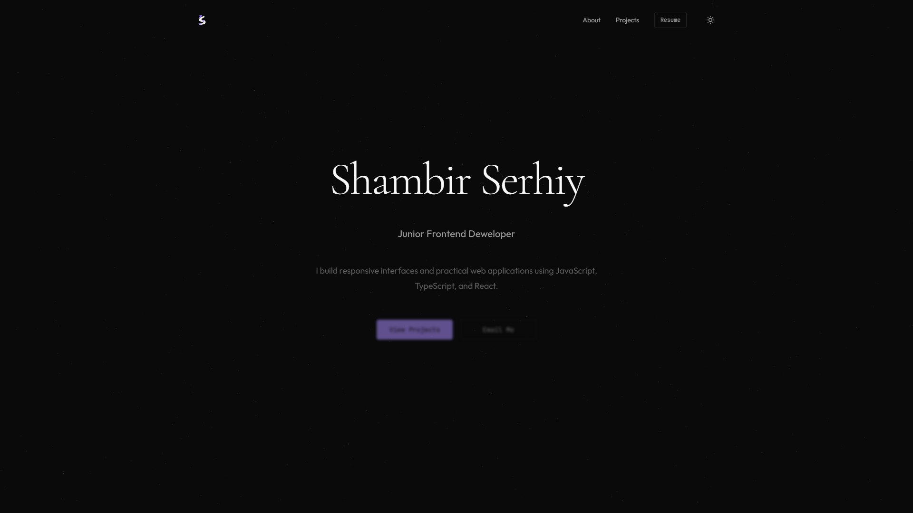

# Portfolio Website

Personal frontend portfolio built with React, TypeScript, and Tailwind CSS.

## 🔗 Live Demo

https://vitaliifedunyk.vercel.app

## 📸 Preview

## 📌 Overview

This is my personal portfolio website, designed to present my projects, technical skills, and development approach.

The website focuses on clean UI, responsive layout, and smooth user experience.

## ⚙️ Features

* Responsive design across devices
* Reusable React components
* Animated UI with Framer Motion
* Project showcase with structured layout
* Dark and light theme switching

## 🛠 Tech Stack

* React
* TypeScript
* Tailwind CSS
* Framer Motion
* Vite

## 📊 Focus

* Component-based architecture
* UI/UX design and user experience
* Animation and interaction
* Clean and scalable frontend structure

## 🚀 Run Locally

npm install
npm run dev
